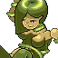

# Bosses
:warning: work in progress!

| | Name | Area
|-|-|-|
|  | Toots | Totory Dunes
|  | Mocto | Profundum Sea
|  | Cracker | Maggy Volcano
|  | Boss Lamia | Phucken Marsh
|  | Whiter Rabbider | Stiffchub Lake
|  | Dryad | Notternback Forest
|  | Heydeez | Hiyass Mountain
|  | Boss Angel | Last Boss
|  | Piyori Cap | Weerdough Plains
|  | Bossmandrake | Maggy Temple
|  | Boss Gnuk | Tepid Springs
|  | Tigbitty | Sweetums Hill
|  | Super Evil Sukumizu | Real Last Boss
|  | God | World Map
