# Equipments and Items
:warning: work in progress!

## Weapons
- Must be equipped on the `WEP` slot  
- Some weapons produce special effects when hit  
- Some weapons produce special effects when charged

`©` - produces special effect when charged  
`§` - can change into Flame, Freeze or Hero Sword under certain conditions

| Type | | Weapon | Uses | Atk | Debuffs | Effects
|:-:|:-:|-|:-:|:-:|:-:|-|
| Axe  |  | Lumberjack Ax  |  96 |  +32 | SKL-8 SPD-8       | `©`Boulders
| Axe  |          | Battle Ax      |  96 |  +64 | SKL-8 SPD-8       | `©`Boulders
| Axe  |        | Big-Ass Ax     | 128 | +128 | SKL-8 SPD-8       | [No-exp] `©`Boulders
| Bow  |        | Ainu Arrow     |  96 |  +24 | DEF-8 SPD-8       | Chance of poison
| Bow  |        | Normal Bow     |  96 |  +16 | DEF-8 SPD-8       |
| Bow  |  | Rapidfire Bow  |  96 |  +24 | DEF-8 SPD-8       | Fires 3 arrows
| Bat  |            | Gold Bat       | 255 |  +48 | SKL-16 SPD-16     | [Fatigue][No-exp]
| Bat  |          | Metal Bat      | 255 |  +24 | SKL-16 SPD-16     | [Fatigue]
| Club |  | Hardcore Club  | 128 |  +64 | -                 | [Fatigue]
| Club |      | Normal Club    |  64 |  +16 | -                 | [Fatigue]
| Club |      | Shitty Club    |  16 |   +8 | -                 | [Fatigue]
| Club |      | Spiked Club    |  96 |  +32 | -                 | [Fatigue]
| Staff|      | Flame Staff    |  96 |  +32 | DEF-8 SKL-8 SPD-8 | `©`Burns
| Staff|    | Freeze Staff   |  96 |  +32 | DEF-8 SKL-8 SPD-8 | `©`Freezes
| Staff|    | Shitty Staff   |  16 |   +8 | ?                 | ?
| Staff|      | Storm Staff    |  96 |  +24 | DEF-8 SPD-8       | `©`Knocks
| Staff|  | Thunder Staff  |  96 |  +32 | DEF-8 SKL-8 SPD-8 | `©`Paralyzes
| Sword|      | Blunt Sword    |  16 |   +8 | ?                 | ?
| Sword|    | Freeze Sword   |  96 |  +32 | -                 | Freezes
| Sword|    | Normal Sword   | 128 |  +24 | -                 | `§`Changes
| Sword|      | Steel Sword    | 255 |  +48 | SKL-16 SPD-16     |
| Sword|  | Vampire Sword  |  96 |  +24 | MHP-16 DEF-8      |

## Guards
- Must be equipped on the `GRD` slot  
- Some guard equipments prevent effects while in use  

| Type | | Equipment | Durab. | Def | Buffs / Debuffs | Effects
|:-:|:-:|-|:-:|:-:|:-:|-|
| Armor    |            | Normal Armor      |  96 |  +24 | SKL-8 SPD-8          | -
| Armor    | 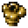           | Shitty Armor      |   ? |    ? | ?                    | ?
| Armor    |              | Steel Armor       | 255 |  +48 | SKL-16 SPD-16        | -
| Armor    |            | Sturdy Armor      | 128 |  +36 | SKL-12 SPD-12        | -
| Bodysuit |          | Battle Tights     |   ? |    ? | ?                    | ?
| Bodysuit |                | Bunny Suit        |  96 |  +16 | ATK+8 SKL+32 SPD+24  | [Naughty]
| Bodysuit |                    | Lucktard          |   8 | +255 | -                    | [Naughty][All Resist]
| Bodysuit |                    | Sukumizu          |  64 |   +8 | SKL+24 SPD+32        | [Naughty][Water Resist]
| Bodysuit |        | White Sukumizu    |  96 |  +12 | SKL+24 SPD+32        | [Naughty][Water Resist]
| Cape     |        | Adventure Cape    |   ? |    ? | ?                    | ?
| Cape     |                  | King Cape         |  96 |  +24 | SPD+8                | -
| Gloves   |            | Steel Gloves      | 255 |  +28 | ATK+28 SKL-9 SPD-9   | -
| Helmet   |            | Steel Helmet      | 255 |  +24 | SKL+16 SPD-8         | [Unstunnable]
| Jewel    |        | R. Dragon Jewel   | 128 |  +16 | ATK+48 SKL+16 SPD+16 | [Unburnable]
| Ring     |            | Evasion Ring      |   ? |    ? | ?                    | ?
| Ring     |      | Experience Ring   |  96 |    - | -                    | [EXP x2]
| Ring     |              | Pirate Ring       |  96 |    - | -                    | [Drop x2]
| Ring     |              | Sacred Ring       |  96 |    - | MHP+96               | Regenerates HP
| Shield   |  | Cold-Proof Shield |  96 |  +24 | -                    | [Unmeltable] Freeze
| Shield   |            | Flame Shield      |   ? |    ? | ?                    | ?
| Shield   |              | Holy Shield       |   ? |    ? | ?                    | ?
| Shield   |          | Normal Shield     |  96 |  +24 | -                    | [Unmeltable]
| Shield   | 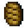                     | Pot Lid           |  64 |  +16 | -                    | [Unmeltable]
| Shield   |            | Steel Shield      | 255 |  +32 | SKL-8 SPD-8          | [Unmeltable]

## Offensive Items
- Can be equipped on the `ITEM` slot for quick use

| Type | | Item | Uses | Description
|:-:|:-:|-|:-:|-
| Damage  |    | Big-Ass Grenade  | ? | ?
| Damage  | 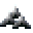                   | Caltrop          | ? | ?
| Damage  |        | Landmine Trap    | ? | ?
| Damage  | 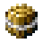         | Tiny Grenade     | ? | ?
| Effect  |                  | Birdlime         | ? | ?
| Effect  | 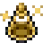         | Brown Sludge     | ? | ?
| Effect  |      | Paralysis Trap   | ? | ?
| Effect  |          | Pervy Liquid     | ? | ?
| Effect  |              | Sleep Trap       | ? | ?
| DmgEff  |      | Flame Grimoire   | 3 | Flame Magic [Skill][Damage][Burn]
| DmgEff  |          | Ice Grimoire     | ? | ?
| DmgEff  |  | Thunder Grimoire | 3 | Thunder Magic [Skill][Damage][Paralysis]

## Enhancement Items
- Can be equipped on the `ITEM` slot for quick use
- Enhances the equipped WPN / GRD

| | Enhancement Item | Uses | Provides one of the following enhancements
|:-:|-|:-:|-|
|        | Grd Enhancement Kit    | 3 | Defensive, Agile, Heavy, Invigorating, Jumping, Powerful, Sacred, Skillful
|        | Wpn Enhancement Kit    | 3 | Offensive, Agile, Heavy, Invigorating, Jumping, Powerful, Sacred, Skillful
|    | Grd Enhancement Kit G  | 3 | Holy, Lightspeed, Sonic, Technical, Impregnable, Invincible, Masochistic
|    | Wpn Enhancement Kit G  | 3 | Holy, Lightspeed, Sonic, Technical, Assault, Destructive, Sadistic

## Utility Items
- Can be equipped on the `ITEM` slot for quick use

| Type | | Item | Effects
|:-:|:-:|-|-|
| Repair   |       | Grd Repair Kit   | ?
| Repair   |       | Wpn Repair Kit   | ?
| Repair   |   | Grd Repair Kit G | ?
| Repair   |   | Wpn Repair Kit G | ?
| Effect   |       | Return Feather   | ?
| Effect   |         | Warehouse Pot    | ?
| Effect   |                       | Scroll           | ?

## Recovery Items
- Can be equipped on the `ITEM` slot for quick use

| | Recovery Item| HP+ |
|:-:|-|-|
|                              | Medicine               | 50%?
|              | Awesome Medicine       | 80%?
| 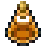           | Ultimate Medicine      | 100%?

|  | Food | HP+ | AP+ |
|:-:|-|-|-
| 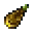                     | Bamboo Shoot           | 20% | 20% |
|                                  | Banana                 | 30% | 45% |
|                                    | Berry                  | 50% | 75% |
|                    | Blanched Crab          | 50% | 60% |
|                              | Brocolli               | 30% | 30% |
|                                  | Carrot                 | 10% | 10% |
|  | Classy Grilled Veggies | 60% | 60% |
|                                      | Corn                   | 40% | 40% |
|                      | Fried Prawns           | 50% | 60% |
|                    | Frozen Banana          | 45% | 70% |
|                      | Frozen Melon           | 60% | 90% |
|                      | Grilled Fish           | 45% | 50% |
| 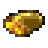                     | Grilled Meat           | 45% | 50% |
| 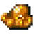               | Grilled Octopus        | 45% | 50% |
|                    | Grilled Squid          | ?   | ?   |
|                                    | Melon                  | 40% | 60% |
|                              | Mushroom               | 20% | 20% |
|                                    | Onion                  | 10% | 10% |
|                                  | Radish                 | 30% | 30% |
|                              | Raw Crab               | 20% | 30% |
|                              | Raw Fish               | 10% | 20% |
| 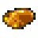                             | Raw Meat               | 10% | 20% |
|                        | Raw Octopus            | 10% | 20% |
|                          | Raw Shrimp             | 20% | 30% |
|                            | Raw Squid              | 10% | 20% |

## Permanent Buff Items
- Can be equipped on the `ITEM` slot for quick use

| | Item | Buff
|:-:|-|-|
|              | Funny Grass       | LV+1
|  | Invigorating Seed | MAP+3
| 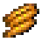       | Offensive Seed    | ATK+1
|      | Protective Seed   | DEF+1
| 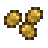             | Sacred Seed       | MHP+5

## Other

| Type | | Item | Effects |
|:-:|:-:|-|-|
| Craft   |                      | Material           | ?
| Craft   | 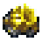             | Pretty Stone       | [Cash In]
| Hold    |            | Antisuck Robe      | [Cash In] [Naughty] Prevents vampiric powers
| Hold    |                            | Badass Badge       | [Special] Survives fatal blows 50%
| Hold    |                            | Cleanfreak Badge   | [Special] Prevents item degradation
| Hold    |                            | Dumbass Badge      | [Special] Weakens enemies
| Hold    |                            | Fireproof Badge    | [Special] Prevents item burning
| Hold    |                            | Observation Badge  | [Special] Signalizes hidden rooms
| Hold    |                            | Regeneration Badge | [Special] Regenerates HP
| Hold    |  | Regeneration Grass | [Special] Revives after fatal blows
| KeyItem |        | Tanning Machine    | [???] Somebody may need this
| KeyItem | 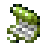 | Weird Green Scroll | [???] Makes one boss fight easier
| Trash   |                | Broken Trap        | [Trash]
| Trash   | 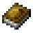                     | Wet Book           | [Trash]
| Trash   |                  | Wet Scroll         | [Trash]

## References
This page uses some information from the Hakoniwa Explorer Plus Wiki: https://hakoniwa-explorer-plus.fandom.com/