# Equipments and Items
:warning: work in progress!

## Weapons
- Must be equipped on the `WEP` slot  
- Some weapons produce special effects when hit  
- Some weapons produce special effects when charged

`©` - produces special effect when charged  
`§` - can change into Flame, Freeze or Hero Sword under certain conditions

| Type | Image | Name | Uses | Atk | Debuffs & Negative Effects | Special Effects
|:-:|:-:|-|:-:|:-:|:-|:-|
| Axe  | 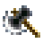                   | Lumberjack Ax          |  96 |  +32 | SKL-8 SPD-8   | `©`Boulders
| Axe  | 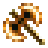                           | Battle Ax              |  96 |  +64 | SKL-8 SPD-8   | `©`Boulders
| Axe  |                          | Big-Ass Ax             | 128 | +128 | SKL-8 SPD-8   [No-exp] | `©`Boulders
| Bow  | 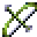                         | Ainu Arrow             |  96 |  +24 | DEF-8 SPD-8   | Chance of poison
| Bow  | 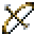                         | Normal Bow             |  96 |  +16 | DEF-8 SPD-8   |
| Bow  |                    | Rapidfire Bow          |  96 |  +24 | DEF-8 SPD-8   | Fires 3 arrows
| Bat  | 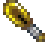                             | Gold Bat               | 255 |  +48 | SKL-16 SPD-16 [Fatigue][No-exp]
| Bat  | 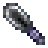                           | Metal Bat              | 255 |  +24 | SKL-16 SPD-16 [Fatigue]
| Club |                    | Hardcore Club          | 128 |  +64 |               [Fatigue]
| Club |                        | Normal Club            |  64 |  +16 |               [Fatigue]
| Club | 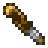                       | Shitty Club            |  16 |   +8 |               [Fatigue]
| Club | 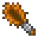                       | Spiked Club            |  96 |  +32 |               [Fatigue]
| Staff|                        | Flame Staff            |  96 |  +32 | DEF-8 SKL-8 SPD-8 | `©`Burns
| Staff|                      | Freeze Staff           |  96 |  +32 | DEF-8 SKL-8 SPD-8 | `©`Freezes
| Staff|                      | Shitty Staff           |  16 |   +8 | 
| Staff| 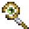                       | Storm Staff            |  96 |  +24 | DEF-8 SPD-8       | `©`Knocks
| Staff|                    | Thunder Staff          |  96 |  +32 | DEF-8 SKL-8 SPD-8 | `©`Paralyzes
| Sword| 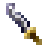                       | Blunt Sword            |  16 |   +8 |                            
| Sword|                      | Freeze Sword           |  96 |  +32 |                   | Freezes
| Sword|                      | Normal Sword           | 128 |  +24 |                   | `§`Changes
| Sword| 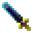                       | Steel Sword            | 255 |  +48 | SKL-16 SPD-16     |
| Sword| 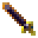                   | Vampire Sword          |  96 |  +24 | MHP-16 DEF-8      |

## Guards
- Must be equipped on the `GRD` slot  
- Some guard equipments prevent effects while in use  

| Type | Image | Name |
|:-:|:-:|:-|
| Armor    |                      | Normal Armor           |
| Armor    |                      | Shitty Armor           |
| Armor    |                        | Steel Armor            |
| Armor    |                      | Sturdy Armor           |
| Bodysuit | 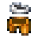                   | Battle Tights          |
| Bodysuit |                          | Bunny Suit             |
| Bodysuit | 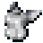                             | Lucktard               |
| Bodysuit |                              | Sukumizu               |
| Bodysuit |                  | White Sukumizu         |
| Cape     | 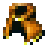                 | Adventure Cape         |
| Cape     |                            | King Cape              |
| Gloves   |                      | Steel Gloves           |
| Helmet   | 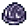                     | Steel Helmet           |
| Jewel    | 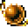                 | R. Dragon Jewel        |
| Ring     |                      | Evasion Ring           |
| Ring     |                | Experience Ring        |
| Ring     |                        | Pirate Ring            |
| Ring     |                        | Sacred Ring            |
| Shield   |            | Cold-Proof Shield      |
| Shield   | 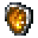                     | Flame Shield           |
| Shield   |                        | Holy Shield            |
| Shield   | 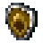                   | Normal Shield          |
| Shield   |                                | Pot Lid                |
| Shield   |                      | Steel Shield           |

## Offensive Items
- Can be equipped on the `ITEM` slot for quick use

| Type | Image | Name | Uses | Description
|:-:|:-:|:-|:-:|:-
| Damage   | 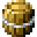               | Big-Ass Grenade        |
| Damage   |                                | Caltrop                |
| Damage   |                    | Landmine Trap          |
| Damage   |                      | Tiny Grenade           |
| Effect   |                              | Birdlime               |
| Effect   |                      | Brown Sludge           |
| Effect   |                  | Paralysis Trap         |
| Effect   |                      | Pervy Liquid           |
| Effect   |                          | Sleep Trap             |
| Dmg_Eff  | 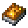                 | Flame Grimoire         | 3 | Flame Magic [Skill][Damage][Burn] 
| Dmg_Eff  |                      | Ice Grimoire           |
| Dmg_Eff  | 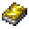             | Thunder Grimoire       | 3 | Thunder Magic [Skill][Damage][Paralysis]

## Utility Items
- Can be equipped on the `ITEM` slot for quick use

| Type | Image | Name |
|:-:|:-:|:-|
| Enhance  | 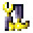   | Grd Enhancement Kit G  |
| Enhance  |        | Grd Enhancement Kit    |
| Enhance  | 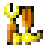   | Wpn Enhancement Kit G  |
| Enhance  |        | Wpn Enhancement Kit    |
| Repair   |              | Grd Repair Kit G       |
| Repair   |                  | Grd Repair Kit         |
| Repair   |              | Wpn Repair Kit G       |
| Repair   | 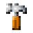                 | Wpn Repair Kit         |                                        
| Effect   |                  | Return Feather         |
| Effect   | 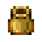                   | Warehouse Pot          |

## Consumable Items
- Can be equipped on the `ITEM` slot for quick use

| Type | Image | Name |
|:-:|:-:|:-|
| ?        |                                  | Scroll                 |
| Food     |                      | Bamboo Shoot           |
| Food     | 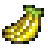                                 | Banana                 |
| Food     |                                    | Berry                  |
| Food     | 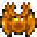                   | Blanched Crab          |
| Food     | 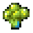                             | Brocolli               |
| Food     | 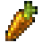                                 | Carrot                 |
| Food     |  | Classy Grilled Veggies |
| Food     | 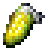                                     | Corn                   |
| Food     |                      | Fried Prawns           |
| Food     | 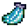                   | Frozen Banana          |
| Food     |                      | Frozen Melon           |
| Food     |                      | Grilled Fish           |
| Food     |                      | Grilled Meat           |
| Food     |                | Grilled Octopus        |
| Food     | 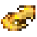                   | Grilled Squid          |
| Food     | 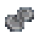           | Invigorating Seed      |
| Food     | 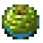                                   | Melon                  |
| Food     |                              | Mushroom               |
| Food     |                                    | Onion                  |
| Food     | 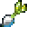                                 | Radish                 |
| Food     | 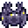                             | Raw Crab               |
| Food     |                              | Raw Fish               |
| Food     |                              | Raw Meat               |
| Food     |                        | Raw Octopus            |
| Food     |                          | Raw Shrimp             |
| Food     |                            | Raw Squid              |
| Medicine |              | Awesome Medicine       |
| Medicine | 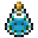                             | Medicine               |
| Medicine |            | Ultimate Medicine      |
| PermBuff |                        | Funny Grass            |
| PermBuff |                  | Offensive Seed         |
| PermBuff |                | Protective Seed        |
| PermBuff |                        | Sacred Seed            |

## Other

| Type | Image | Name | Description |
|:-:|:-:|:-:|:-|
| Craft    |                              | Material               |
| Craft    |                      | Pretty Stone           | [Cash In]
| Hold     |                    | Antisuck Robe          | [Cash In] [Naughty] Prevents vampiric powers
| Hold     |                                    | Badass Badge           | [Special] Survives fatal blows 50%
| Hold     |                                    | Cleanfreak Badge       | [Special] Prevents item degradation
| Hold     |                                    | Dumbass Badge          | [Special] Weakens enemies
| Hold     |                                    | Fireproof Badge        | [Special] Prevents item burning
| Hold     |                                    | Observation Badge      | [Special] Signalizes hidden rooms
| Hold     |                                    | Regeneration Badge     | [Special] Regenerates HP
| Hold     |          | Regeneration Grass     | [Special] Revives after fatal blows
| Key_Item |                | Tanning Machine        | [???] Somebody may need this
| Key_Item |          | Weird Green Scroll     | [???] Makes one boss fight easier
| Trash    | 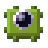                       | Broken Trap            | [Trash]
| Trash    |                              | Wet Book               | [Trash]
| Trash    |                          | Wet Scroll             | [Trash]

## References
This page uses some information from the Hakoniwa Explorer Plus Wiki: https://hakoniwa-explorer-plus.fandom.com/