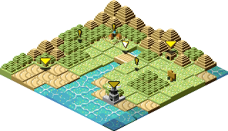
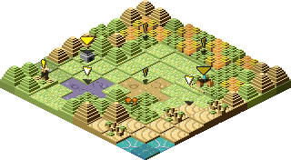
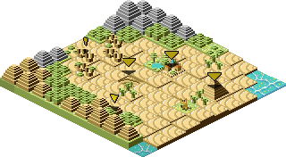
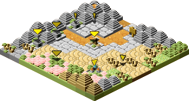
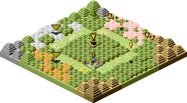
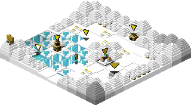
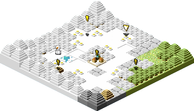
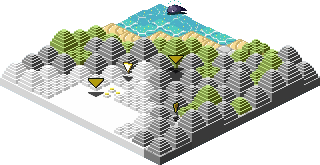

# Regions
See also: [Towns](towns.md), [Shops](shops.md), [Points of Interest](places.md)

:warning: work in progress!

First region &ndash;
Profundum region &ndash;
Phucken Marsh region &ndash;
Totory Dunes region &ndash;
Maggy region &ndash;
Notternback Forest &ndash;
Stiffchub Lake &ndash;
Chillbrae region &ndash;
Hiyass Mountain

## World Map

## First region
Dreem Beach &ndash;
Firstbridge &ndash;
Firsttown &ndash;
Notternback Forest A &ndash;
Toarch Cave &ndash;
Twinkell Lighthouse &ndash;
Weerdough Plains

## Profundum region
Dreem Beach &ndash;
Gewfoff Beach &ndash;
Nawaoki &ndash;
Profundum Trench

## Phucken Marsh region
Encore Watt Ruins &ndash;
Gewfoff Beach &ndash;
Grotee Marsh &ndash;
Notternback Forest C &ndash;
Phucken Marsh &ndash;
Stiffchub Mines &ndash;
Tepid Springs &ndash;
Wettingham

## Totory Dunes region
Cuffe Ruins &ndash;
Hopstep &ndash;
Toarch Cave &ndash;
Totory &ndash;
Totory Dunes

## Maggy region
Hopstep &ndash;
Maggy Cave &ndash;
Maggy Mines &ndash;
Maggy Temple &ndash;
Maggy Volcano &ndash;
Notternback Forest B &ndash;
Shuzo

## Notternback Forest
Mundus Arbos &ndash;
Notternback Forest A &ndash;
Notternback Forest B &ndash;
Notternback Forest C &ndash;
Notternback Forest D &ndash;
Riza Ruins

## Stiffchub Lake
Chillbrae Cave &ndash;
Stiffchub City &ndash;
Stiffchub Clock Tower &ndash;
Stiffchub Lake &ndash;
Stiffchub Mines

## Chillbrae region
Chillbrae &ndash;
Chillbrae Cave &ndash;
Chillbrae Snowlands &ndash;
Notternback Forest D &ndash;
Sweetums Hill

## Hiyass Mountain
Chillbrae Snowlands &ndash;
Dafuq Abyss &ndash;
Hiyass Mountain &ndash;
Maggy Mines

