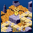
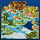

# Points of Interest
See also: [Regions](regions.md), [Towns](towns.md), [Shops](shops.md)

:warning: work in progress!

|                                  | Place / Region     |                       |    |   |        |
|----------------------------------|--------------------|-----------------------|:--:|:-:|:------:|
|            | First region       | Dreem Beach           | 2  | 3 |   8    |
|            | First region       | Firstbridge           | 1  | 3 |   4    |
|              | First region       | Firsttown             | 1  | 1 |   14   |
|   | First region       | Notternback Forest A  | 1  | 3 |   10   |
|            | First region       | Toarch Cave           | 2  | 4 |   8    |
|    | First region       | Twinkell Lighthouse   | 2  | 4 |   8    |
|       | First region       | Weerdough Plains      |    |   |        |
|            | Totory Dunes       | Cuffe Ruins           | 8  | 1 |   14   |
|                | Totory Dunes       | Hopstep               | 3  | 3 |   7    |
|            | Totory Dunes       | Toarch Cave           | 2  | 4 |   8    |
|                 | Totory Dunes       | Totory                | 1  | 1 |   3    |
|           | Totory Dunes       | Totory Dunes          | 3  | 2 |   10   |
|                | Maggy              | Hopstep               | 3  | 3 |   7    |
|             | Maggy              | Maggy Cave            | 5  | 5 |   14   |
|            | Maggy              | Maggy Mines           | 4  | 2 |   14   |
|           | Maggy              | Maggy Temple          |    |   |        |
|          | Maggy              | Maggy Volcano         | 11 | 4 |   9    |
|   | Maggy              | Notternback Forest B  | 1  | 1 |   10   |
|                  | Maggy              | Shuzo                 | 1  | 2 |   3    |
|            | Profundum          | Dreem Beach           | 2  | 3 |   8    |
|          | Profundum          | Gewfoff Beach         | 3  | 4 |   7    |
|                | Profundum          | Nawaoki               | 1  | 2 |   3    |
|       | Profundum          | Profundum Trench      | 8  | 1 |   14   |
|      | Phucken Marsh      | Encore Watt Ruins     | 9  | 5 |   14   |
|          | Phucken Marsh      | Gewfoff Beach         | 3  | 4 |   7    |
|          | Phucken Marsh      | Grottee Marsh         | 4  | 2 |   10   |
|   | Phucken Marsh      | Notternback Forest C  | 2  | 1 |   10   |
|          | Phucken Marsh      | Phucken Marsh         | 4  | 4 |   9    |
|        | Phucken Marsh      | Stiffchub Mines       | 5  | 5 | 10/16? |
|          | Phucken Marsh      | Tepid Springs         |    |   |        |
|             | Phucken Marsh      | Wettingham            | 1  | 1 |   2    |
|         | Stiffchub Lake     | Chillbrae Cave        | 5  | 5 |   10   |
|         | Stiffchub Lake     | Stiffchub City        | 1  | 1 |   4    |
|  | Stiffchub Lake     | Stiffchub Clock Tower | 10 | 1 |   11   |
|         | Stiffchub Lake     | Stiffchub Lake        | 5  | 5 |   16   |
|        | Stiffchub Lake     | Stiffchub Mines       | 5  | 5 | 10/16? |
|              | Chillbrae          | Chillbrae             | 1  | 2 |   3    |
|         | Chillbrae          | Chillbrae Cave        | 5  | 5 |   10   |
|    | Chillbrae          | Chillbrae Snowlands   | 4  | 5 |   9    |
|   | Chillbrae          | Notternback Forest D  | 1  | 2 |   10   |
|          | Chillbrae          | Sweetums Hill         |    |   |        |
|    | Hiyass Mountain    | Chillbrae Snowlands   | 4  | 5 |   9    |
|            | Hiyass Mountain    | Dafuq Abyss           | 11 | 5 |   14   |
|        | Hiyass Mountain    | Hiyass Mountain       | 6  | 4 |   9    |
|            | Hiyass Mountain    | Maggy Mines           | 4  | 2 |   14   |
|           | Notternback Forest | Mundus Arbos          | 1  | 2 |   5    |
|   | Notternback Forest | Notternback Forest A  | 1  | 3 |   10   |
|   | Notternback Forest | Notternback Forest B  | 1  | 1 |   10   |
|   | Notternback Forest | Notternback Forest C  | 2  | 1 |   10   |
|   | Notternback Forest | Notternback Forest D  | 1  | 2 |   10   |
|             | Notternback Forest | Riza Ruins            | 7  | 3 |   16   |
