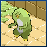
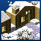

# Points of Interest
See also: [Regions](regions.md), [Towns](towns.md), [Shops](shops.md)

:warning: work in progress!

## First region

|                                 | Place                |   |   |    |
|---------------------------------|----------------------|:-:|:-:|:--:|
|           | Dreem Beach          | 2 | 3 | 8  |
|           | Firstbridge          | 1 | 3 | 4  |
|             | Firsttown            | 1 | 1 | 14 |
|  | Notternback Forest A | 1 | 3 | 10 |
|           | Toarch Cave          | 2 | 4 | 8  |
|   | Twinkell Lighthouse  | 2 | 4 | 8  |
|      | Weerdough Plains     | * | * | *  |

## Notternback Forest region

|                                 | Place                |   |   |    |
|---------------------------------|----------------------|:-:|:-:|:--:|
|          | Mundus Arbos         | 1 | 2 | 5  |
|  | Notternback Forest A | 1 | 3 | 10 |
|  | Notternback Forest B | 1 | 1 | 10 |
|  | Notternback Forest C | 2 | 1 | 10 |
|  | Notternback Forest D | 1 | 2 | 10 |
|            | Riza Ruins           | 7 | 3 | 16 |

## Totory Dunes

|                         | Place        | | | |
|-------------------------|--------------|:-:|:-:|:--:|
|   | Cuffe Ruins  | 8 | 1 | 14 |
|       | Hopstep      | 3 | 3 | 7  |
|   | Toarch Cave  | 2 | 4 | 8  |
|        | Totory       | 1 | 1 | 3  |
|  | Totory Dunes | 3 | 2 | 10 |

## Profundum region

|                             | Place            | | | |
|-----------------------------|------------------|:-:|:-:|:--:|
|       | Dreem Beach      | 2 | 3 | 8  |
|     | Gewfoff Beach    | 3 | 4 | 7  |
|           | Nawaoki          | 1 | 2 | 3  |
|  | Profundum Trench | 8 | 1 | 14 |

## Maggy region

|                                 | Place                |    |   |    |
|---------------------------------|----------------------|:--:|:-:|:--:|
|               | Hopstep              | 3  | 3 | 7  |
|            | Maggy Cave           | 5  | 5 | 14 |
|           | Maggy Mines          | 4  | 2 | 14 |
|          | Maggy Temple         | *  | * | *  |
|         | Maggy Volcano        | 11 | 4 | 9  |
|  | Notternback Forest B | 1  | 1 | 10 |
|                 | Shuzo                | 1  | 2 | 3  |

## Phucken Marsh region

|                                 | Place                |   |   |     |
|---------------------------------|----------------------|:-:|:-:|:---:|
|     | Encore Watt Ruins    | 9 | 5 | 14  |
|         | Gewfoff Beach        | 3 | 4 |  7  |
|         | Grottee Marsh        | 4 | 2 | 10  |
|  | Notternback Forest C | 2 | 1 | 10  |
|         | Phucken Marsh        | 4 | 4 |  9  |
|       | Stiffchub Mines      | 5 | 5 | 16 ? |
|         | Tepid Springs        | * | * |  *  |
|            | Wettingham           | 1 | 1 |  2  |

## Stiffchub Lake region

|                                  | Place                 |    |   |     |
|----------------------------------|-----------------------|:--:|:-:|:---:|
|         | Chillbrae Cave        | 5  | 5 | 10  |
|         | Stiffchub City        | 1  | 1 |  4  |
|  | Stiffchub Clock Tower | 10 | 1 | 11  |
|         | Stiffchub Lake        | 5  | 5 | 16  |
|        | Stiffchub Mines       | 5  | 5 | 16 ? |

## Chillbrae region

|                                 | Place                |   |   |    |
|---------------------------------|----------------------|:-:|:-:|:--:|
|             | Chillbrae            | 1 | 2 | 3  |
|        | Chillbrae Cave       | 5 | 5 | 10 |
|   | Chillbrae Snowlands  | 4 | 5 | 9  |
|  | Notternback Forest D | 1 | 2 | 10 |
|         | Sweetums Hill        | * | * | *  |

## Hiyass Mountain region

|                                | Place               |    |   |    |
|--------------------------------|---------------------|:--:|:-:|:--:|
|  | Chillbrae Snowlands | 4  | 5 | 9  |
|          | Dafuq Abyss         | 11 | 5 | 14 |
|      | Hiyass Mountain     | 6  | 4 | 9  |
|          | Maggy Mines         | 4  | 2 | 14 |

