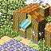
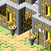
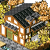
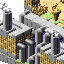
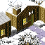
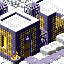
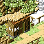
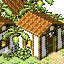

# Shops
See also: [Regions](map.md), [Towns](towns.md), [Items](items.md)

All Hakoniwa Explorer Plus [towns](towns.md) have equipment and item shops with varying items.

Shops are ranked on 5 levels, starting with Level 1 and improving according to specific conditions.

- [Item Shops](#items-shops) can be improved by completing achievements.
- [Equipment Shops](#equipment-shops) can be improved by giving weapon and guard materials.
- [Nawaoki Shops](#nawaoki-shops) have items that can not be found in any other shops.

> :warning: work in progress! To do list:
> - Grudge Shitty Shop
> - Grudge Special Shop
> - Debug Room Shops

## Equipment Shops

<table class="top"><thead><tr>
  <th>Town</th>
  <th>Firsttown</th>
  <th>Totory</th>
  <th>Wettingham</th>
  <th>Shuzo</th>
  <th>Chillbrae</th>
  <th>Stiffchub</th>
  <th>M. Arbos</th>

</tr></thead><tbody><tr><th>Weapons</th><td>
  
<b>Sword</b> Normal Steel

  
<b>Club</b> Normal Spiked Hardcore

  
<b>Bat</b> Metal Gold

</td><td>
  
<b>Sword</b> Normal Steel

  
<b>Claws</b> Normal Poison Paralyze Steel Beast King

</td><td>
  
<b>Sword</b> Normal Bullseye

  
<b>Bow</b> Normal Three-way Rapidfire

</td><td>
  
<b>Sword</b> Normal Flame

  
<b>Ax</b> Lumberjack Battle Big-ass

</td><td>
  
<b>Sword</b> Normal Freeze

</td><td>
  
<b>Sword</b> Normal Steel

  
<b>Sickle</b> Grass Dodgy Decapitating

</td><td>
  
<b>Sword</b> Normal Glass

  
<b>Staff</b> Storm Flame Freeze Thunder

</td>

</tr><tr><th>Guards</th><td>
  
<b>Shield</b> Pot Lid Normal Steel

  
<b>Armor</b> Normal Steel Sturdy

</td><td>
  
<b>Shield</b> Pot Lid Normal Steel

  
<b>Ring</b> Experience Pirate Antisuck Evasion Sacred

</td><td>
  
<b>Shield</b> Pot Lid Normal Holy

  
<b>Shoes</b> Normal Idaten Sturdy Beerok

</td><td>
  
<b>Shield</b> Pot Lid Normal Heat-proof

  
<b>Gloves</b> Normal Steel Sturdy

</td><td>
  
<b>Shield</b> Pot Lid Normal Cold-proof

  
<b>Hat</b> Winged Safety

  
<b>Helmet</b> Steel

</td><td>
  
<b>Shield</b> Pot Lid Normal Steel

</td><td>
  
<b>Shield</b> Pot Lid Normal

  
<b>Cape</b> Adventure Fairy King Zephyr

</td></tr></tbody></table>

## Items Shops

|Common items (Sold on most towns)|Firsttown|Totory|Wettingham|Shuzo|Chillbrae|Stiffchub|M. Arbos
|-|:-:|:-:|:-:|:-:|:-:|:-:|:-:|
| Medicine Awesome Medicine Wpn.Enhancement Kit Wpn.Repair Kit Wpn.Repair Kit G Grd.Enhancement Kit Grd.Repair Kit Grd.Repair Kit G |:heavy_check_mark:|:heavy_check_mark:|:heavy_check_mark:|:heavy_check_mark:|:heavy_check_mark:|:heavy_check_mark:|:heavy_check_mark:
| Tiny Grenade Big-ass Grenade |:heavy_check_mark:|:heavy_check_mark:|   |:heavy_check_mark:|:heavy_check_mark:|:heavy_check_mark:|   
| Ultimate Medicine      |   |:heavy_check_mark:|:heavy_check_mark:|   |   |   |:heavy_check_mark:

|Town specific items|Firsttown|Totory|Wettingham|Shuzo|Chillbrae|Stiffchub|M. Arbos
|:-:|:-:|:-:|:-:|:-:|:-:|:-:|:-:|
| Attack         |Caltrop|Birdlime|Paralysis Trap|Landmine Trap|Sleep Trap|Sleep Trap| |
| Grimoire       | | |Thunder|Flame|Ice|Ice|All 3
| Permabuff   |Sacred Seed| |Invigorating Seed|Offensive Seed|Protective Seed|Funny Grass|Funny Grass
| Food 1         |Radish|Corn|Mushroom|Raw Meat|Frozen Banana|Frozen Banana|Banana
| Food 2         |Pumpkin|Carrot|Classy Grilled Veggies|Grilled Meat|Frozen Melon|Frozen Melon|Melon
| Food 3         |Onion|Broccoli|Bamboo Shot| | |Frozen Berry|Berry

## Nawaoki Shops

Nawaoki item and guard shops differ greatly from other town shops.

<table class="horiz"><tr>
  <th rowspan="3"></th>
  <th>Bodysuits</th><td>Sukumizu</td><td>White Sukumizu</td><td>Battle Tights</td><td>Bunny Suit</td><td>Lucktard</td>
</tr><tr>
  <th rowspan="2">Food</th><td>Raw Crab</td><td>Raw Fish</td><td>Raw Octopus</td><td>Raw Shrimp</td><td>Raw Squid</td>
</tr><tr>
  <td>Blanched Crab</td><td>Grilled Fish</td><td>Grilled Octopus</td><td>Fried Prawns</td><td>Grilled Squid</td>
</tr></table>
