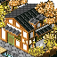
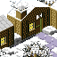

# Towns
:warning: work in progress!

See also: [Regions](map.md), [Shops](shops.md)

| | Town | | Region | Equipments sold | Permabuff sold
|-|-|-:|-|-|-
|       | Firsttown      | SE | First region | Clubs, armors | Sacred seed
|         | Nawaoki        | S  | Profundum region | Bodysuits |
|          | Totory         | E  | Totory Dunes | Claws, rings |
|      | Wettingham     | SW | Phucken Marsh | Bows, shoes | Invigorating seed
|           | Shuzo          | NE | Maggy region | Axes, gloves | Offensive seed
|       | Chillbrae      | NW | Chillbrae region | Helmets | Protective seed
|  | Stiffchub City | W  | Stiffchub Lake | Sickles | Funny grass
|    | Mundus Arbos   | C  | Notternback Forest | Staves, capes | Funny grass
